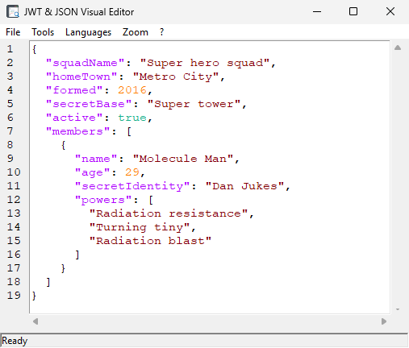

# JWT & JSON Visual Editor

**Version:** 2.0  
**Author:** Jérôme BLONDEL  
**Last Update:** 02/06/2026

## Screenshots



## Description

**JWT & JSON Visual Editor** is a standalone graphical application developed in Python with Tkinter. It offers a comprehensive environment to visualize, edit, validate, and manipulate complex JSON structures as well as JWT (JSON Web Token) payloads.

The tool is designed to be lightweight, performant (even with large files), and easy to use, with a modern and responsive interface.

## Key Features

*   **Visualization & Editing:**
    *   Text editor with syntax highlighting for JSON.
    *   Automatic indentation and formatting ("Beautify").
    *   Zoom in/out on text.
    *   Toggleable Word wrap.
    *   **Dynamic Title:** The window title automatically adapts to show the type of file being edited (JSON or JWT).

*   **Structural Navigation:**
    *   **Tree View:** Explore the hierarchy of your JSON objects and quickly navigate to corresponding keys in the editor.
    *   Bidirectional synchronization between the tree and the editor.

*   **JWT (JSON Web Tokens) Support:**
    *   Automatic detection of JWT strings.
    *   Extraction and decoding of the payload (central part) without requiring a secret key (Base64URL decoding).

*   **Manipulation Tools:**
    *   **Search and Replace:** Optimized, modern dialogs with full features (Ctrl+F, Ctrl+H).
    *   **File Merging (Patching):** Intelligent recursive algorithm to merge a modification file into the current JSON (handling IDs in lists).
    *   **Schema Validation:** Validate your JSON against a schema (supports enumerations and types).
    *   **Context Menu Tools:** Generate IDs (ObjectId, UUID) and update date fields directly from the editor.

*   **Security & Certificates:**
    *   Visualization of X.509 certificate details (Subject CN, Issuer CN) present in JSON values (requires `cryptography` library).
    *   Export of certificates to `.cer` format.
    *   **JWT Certificate Extraction:** Extract public certificates from JWT headers.

*   **Ergonomics:**
    *   **Drag & Drop:** Drag and drop your files directly into the window (requires `tkinterdnd2`).
    *   **Internationalization:** Multi-language interface (FR, EN, ES, DE, IT) managed via a core `languages.json` file. Support for dynamic switching and automatic detection.
    *   **Undo/Redo:** Full Undo/Redo support (Ctrl+Z / Ctrl+Y).

*   **Extensibility (Plugins):**
    *   **Modular Architecture:** Expand functionality via Python plugins organized in categories: `Required`, `Standard`, and `SDS` (Specialized).
    *   **Decentralized Translations:** Each plugin manages its own translations via a local `languages.json` file for easier internationalization.
    *   **Specialized Tools:** Includes plugins like the **SDS Policy Signer** for signing JSON payloads with P12 certificates.

### Included Plugins

Plugins shipped in the `plugins/` folder:

*   **Standard plugins**: Boolean toggle, Certificates viewer/extractor, Extractor (to `extract.json`), JSON Schema Generator
*   **SDS plugins**: Date updater, IDs generator, Import certificates into `certificateData`, P7B Builder (PKCS#7), Policy Signer (P12 → signed JWT)

## Installation

### Prerequisites

*   Python 3.8 or higher recommended.

### Dependencies

For the full feature set (including all plugins), install the project dependencies:

```bash
pip install -r requirements.txt
```

You can also install only what you need via `pip`:

```bash
pip install cryptography tkinterdnd2 pyjwt
```

*   **cryptography**: (Optional) For X.509 certificate management and visualization.
*   **tkinterdnd2**: (Optional) Adds file drag-and-drop support. The application works without it, but this feature will be disabled.
*   **pyjwt**: (Optional) Required by the **SDS Policy Signer** plugin (JWT signing).
*   **pyinstaller**: (Optional) Only required to build the standalone `.exe` (used by `build_exe.bat`).
*   **tkinter**: Normally included by default with Python on Windows.

## Usage

To launch the application, simply execute the script:

```bash
python "JWT & JSON Visual Editor.pyw"
```

### Languages

The language is automatically detected if the filename contains `(FR)` or `(EN)`.
You can also force the language at startup:
```bash
python script.pyw --lang en
```

### Keyboard Shortcuts

| Shortcut | Action |
| :--- | :--- |
| **Ctrl + S** | Save |
| **Ctrl + F** | Search |
| **Ctrl + H** | Replace |
| **Ctrl + Z** | Undo |
| **Ctrl + Y** | Redo |
| **Ctrl + Wheel** | Text Zoom |
| **Shift + Wheel** | Horizontal Scroll |

## Automation Scripts

The project includes two `.bat` scripts to simplify common tasks:

*   **`run_app.bat`**:
    *   **Universal Launcher**: Drag and drop any `.py` or `.pyw` file onto this script to run it.
    *   Automatically sets up the virtual environment if it's missing.
    *   Can create a Desktop shortcut for your application.
    *   Differentiates between GUI (`.pyw`) and Console (`.py`) scripts.

*   **`build_exe.bat`**:
    *   Compiles the application into a standalone binary using **PyInstaller**.
    *   Handles the entire build process including plugin integration and language resource packaging.
    *   The output is placed at the root of the project.
    *   Generates an **`install.bat`** script in the output folder for easy deployment.

---
*Developed to simplify JSON configuration management and JWT debugging.*

***

# JWT & JSON Visual Editor

**Version :** 2.0  
**Auteur :** Jérôme BLONDEL  
**Dernière mise à jour :** 06/02/2026

## Description

**JWT & JSON Visual Editor** est une application graphique autonome (standalone) développée en Python avec Tkinter. Elle offre un environnement complet pour visualiser, éditer, valider et manipuler des structures JSON complexes ainsi que des payloads de jetons JWT (JSON Web Tokens).

L'outil est conçu pour être léger, performant (même avec de gros fichiers) et facile à utiliser, avec une interface moderne et réactive.

## Fonctionnalités Clés

*   **Visualisation & Édition :**
    *   Éditeur de texte avec coloration syntaxique pour JSON.
    *   Indentation automatique et formatage ("Beautify").
    *   Zoom in/out sur le texte.
    *   Retour à la ligne automatique (Word wrap) commutable.
    *   **Titre Dynamique :** Le titre de la fenêtre s'adapte automatiquement pour afficher le type de fichier édité (JSON ou JWT).

*   **Navigation Structurelle :**
    *   **Vue en Arbre (Tree View) :** Explorez la hiérarchie de vos objets JSON et naviguez rapidement vers les clés correspondantes dans l'éditeur.
    *   Synchronisation bidirectionnelle entre l'arbre et l'éditeur.

*   **Support JWT (JSON Web Tokens) :**
    *   Détection automatique des chaînes JWT.
    *   Extraction et décodage du payload (partie centrale) sans nécessiter la clé secrète (décodage Base64URL).

*   **Outils de Manipulation :**
    *   **Recherche et Remplacement :** Dialogues optimisés et modernes avec fonctionnalités complètes (Ctrl+F, Ctrl+H).
    *   **Fusion de Fichiers (Patching) :** Algorithme récursif intelligent pour fusionner un fichier de modifications dans le JSON actuel (gestion des IDs dans les listes).
    *   **Validation de Schéma :** Validez votre JSON contre un schéma (support des énumérations et types).
    *   **Outils Contextuels :** Génération d'identifiants (ObjectId, UUID) et mise à jour des champs date directement depuis l'éditeur.

*   **Sécurité & Certificats :**
    *   Visualisation des détails des certificats X.509 (CN Sujet, CN Émetteur) présents dans les valeurs JSON (requiert la librairie `cryptography`).
    *   Exportation des certificats au format `.cer`.
    *   **Extraction Certificat JWT :** Extraction des certificats publics présents dans les headers JWT.

*   **Ergonomie :**
    *   **Drag & Drop :** Glissez-déposez vos fichiers directement dans la fenêtre (nécessite `tkinterdnd2`).
    *   **Internationalisation :** Interface multilingue (FR, EN, ES, DE, IT) gérée via un fichier `languages.json` principal. Support du basculement à la volée et détection automatique.
    *   **Annuler/Rétablir :** Support complet du Undo/Redo (Ctrl+Z / Ctrl+Y).

*   **Extensibilité (Plugins) :**
    *   **Architecture Modulaire :** Possibilité d'étendre les fonctionnalités via des plugins Python organisés par catégories : `Required`, `Standard`, et `SDS` (Spécialisés).
    *   **Traductions Décentralisées :** Chaque plugin gère ses propres traductions via un fichier `languages.json` local, facilitant l'internationalisation.
    *   **Outils Spécialisés :** Inclut des outils comme le **SDS Policy Signer** pour signer des payloads JSON avec des certificats P12.

### Plugins Inclus

Plugins fournis dans le dossier `plugins/` :

*   **Plugins Standard** : Bascule booléen, Certificats (visualisation/extraction), Extractor (vers `extract.json`), Générateur de schéma JSON
*   **Plugins SDS** : Mise à jour de date, Génération d’IDs, Import de certificats dans `certificateData`, Générateur P7B (PKCS#7), Signature de politique (P12 → JWT signé)

## Installation

### Prérequis

*   Python 3.8 ou supérieur recommandé.

### Dépendances

Pour bénéficier de toutes les fonctionnalités (y compris tous les plugins), installez les dépendances du projet :

```bash
pip install -r requirements.txt
```

Vous pouvez aussi n’installer que ce dont vous avez besoin via `pip` :

```bash
pip install cryptography tkinterdnd2 pyjwt
```

*   **cryptography** : (Optionnel) Pour la gestion et visualisation des certificats X.509.
*   **tkinterdnd2** : (Optionnel) Ajoute le support du glisser-déposer de fichiers. L'application fonctionne sans, mais cette fonctionnalité sera désactivée.
*   **pyjwt** : (Optionnel) Requis par le plugin **SDS Policy Signer** (signature JWT).
*   **pyinstaller** : (Optionnel) Uniquement requis pour compiler l’exécutable `.exe` (utilisé par `build_exe.bat`).
*   **tkinter** : Normalement inclus par défaut avec Python sur Windows.

## Utilisation

Pour lancer l'application, exécutez simplement le script :

```bash
python "JWT & JSON Visual Editor.pyw"
```

### Langues

La langue est détectée automatiquement si le nom du fichier contient `(FR)` ou `(EN)`.
Vous pouvez aussi forcer la langue au démarrage :
```bash
python script.pyw --lang en
```

### Raccourcis Clavier

| Raccourci | Action |
| :--- | :--- |
| **Ctrl + S** | Sauvegarder |
| **Ctrl + F** | Rechercher |
| **Ctrl + H** | Remplacer |
| **Ctrl + Z** | Annuler |
| **Ctrl + Y** | Rétablir |
| **Ctrl + Molette** | Zoom Text |
| **Shift + Molette** | Scroll Horizontal |

## Scripts d'Automatisation

Le projet inclut deux scripts `.bat` pour simplifier les tâches courantes :

*   **`run_app.bat`** :
    *   **Lanceur Universel** : Glissez et déposez n'importe quel fichier `.py` ou `.pyw` sur ce script pour le lancer.
    *   Configure automatiquement l'environnement virtuel s'il est manquant.
    *   Peut créer un raccourci sur le Bureau pour votre application.
    *   Différencie les scripts GUI (`.pyw`) et Console (`.py`).

*   **`build_exe.bat`** :
    *   Compile l'application en un exécutable autonome avec **PyInstaller**.
    *   Gère tout le processus de compilation incluant l'intégration des plugins et des ressources linguistiques.
    *   L'exécutable généré est placé à la racine du projet.
    *   Génère un script **`install.bat`** dans le dossier de sortie pour faciliter le déploiement.

---
*Développé pour simplifier la gestion des configurations JSON et le débogage JWT.*

---
GPL License.